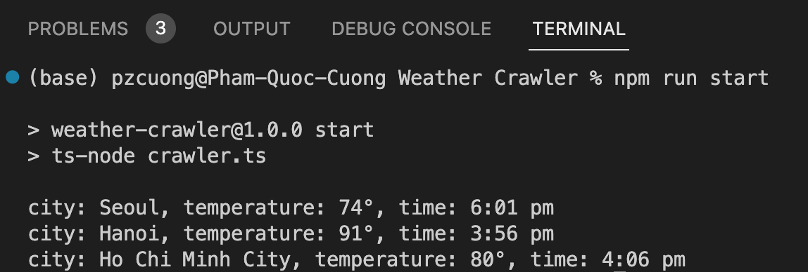

# Weather Data Crawling

This is a simple project that demonstrates how to crawl weather data for multiple cities from weather.com using Puppeteer and TypeScript.

## Project Overview

The project uses Puppeteer, a Node.js library for controlling headless Chrome or Chromium browsers, to scrape weather data from weather.com. It retrieves the current temperature and time for selected cities and displays the information in the console.

## Prerequisites

- Node.js and npm should be installed on your machine.
- Puppeteer package should be installed. You can install it by running `npm install puppeteer`.

## Installation

1. Clone the repository or download the project files.
2. Open a terminal and navigate to the project directory.
3. Run `npm install` to install the project dependencies.

## Usage

1. Open the `crawler.ts` file.
2. Modify the `cities` array to include the desired cities and their corresponding weather.com URLs.
3. Open a terminal and navigate to the project directory.
4. Run `npm run start` to execute the weather data crawling script.
5. The script will crawl the weather data for each city and display the current temperature and time in the console.

## Running result

## Configuration

- You can modify the CSS selector used to locate the temperature element in the `crawlWeatherData` function of `crawler.ts` file. Update the selector if the page structure on weather.com changes.
